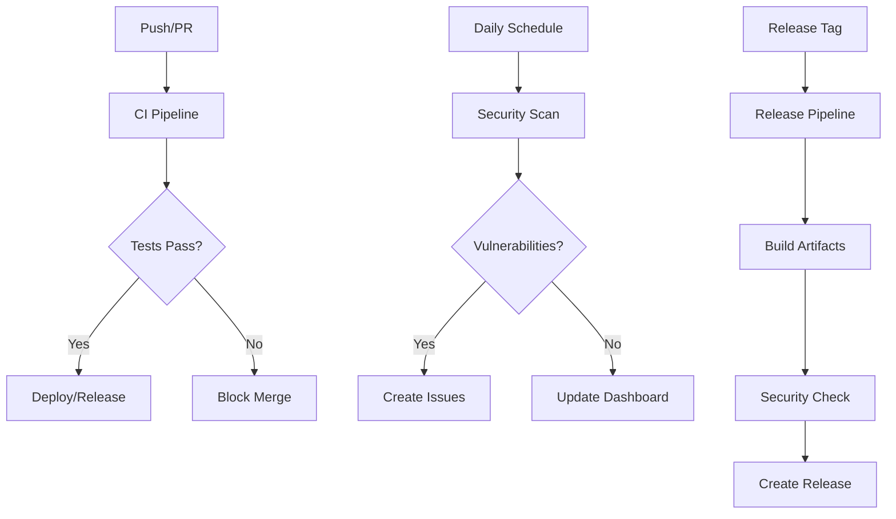

# GitHub Actions Workflows

This directory contains the complete CI/CD automation for Radio Calico. The workflows are designed to provide comprehensive testing, security scanning, and release automation.

## 🚀 Workflows Overview

### 1. Main CI/CD Pipeline (`ci.yml`)

**Triggers:** Push to `main`/`develop`, Pull Requests

**Purpose:** Complete validation pipeline with comprehensive testing and security checks.

**Jobs:**
- **Lint:** Code quality checks (ESLint, Prettier)
- **Security:** Dependency scanning, secrets detection, npm audit
- **Unit Tests:** Full test suite with PostgreSQL service
- **Integration Tests:** End-to-end testing with Docker Compose
- **Docker Build:** Multi-stage container building
- **Container Security:** Trivy vulnerability scanning
- **Deployment Test:** Production environment validation
- **Dependency Check:** Outdated packages analysis

**Key Features:**
- ✅ Multi-environment testing (Node.js 18, PostgreSQL 15)
- ✅ Comprehensive security scanning
- ✅ Test coverage reporting with Codecov
- ✅ Docker multi-platform builds (amd64, arm64)
- ✅ Detailed job summaries and artifacts

### 2. Pull Request Validation (`pr-validation.yml`)

**Triggers:** Pull Request events (opened, synchronize, reopened)

**Purpose:** Fast feedback for PR authors with essential checks.

**Jobs:**
- **PR Validation:** Size analysis, breaking change detection
- **Security Check:** Quick security audit, secrets scanning
- **Critical Tests:** Essential test suite for rapid feedback
- **PR Comment:** Automated status updates on PRs
- **Auto-assign:** Intelligent reviewer assignment

**Key Features:**
- ⚡ Fast execution (< 10 minutes)
- 💬 Automated PR comments with results
- 👥 Smart reviewer assignment based on changed files
- 🔍 Breaking change detection

### 3. Security Monitoring (`security.yml`)

**Triggers:** Daily schedule (6 AM UTC), Manual dispatch

**Purpose:** Comprehensive security monitoring and vulnerability management.

**Jobs:**
- **Dependency Scan:** NPM audit for main and test dependencies
- **Container Scan:** Trivy scanning for Docker images
- **Secret Scan:** Gitleaks scanning for exposed secrets
- **Security Summary:** Consolidated reporting and notifications

**Key Features:**
- 🕕 Daily automated scans
- 🚨 Automatic issue creation for vulnerabilities
- 📊 SARIF reporting for GitHub Security tab
- 🔐 Git history secret scanning
- 📈 Security dashboard in workflow summaries

### 4. Release Automation (`release.yml`)

**Triggers:** Git tags (`v*.*.*`), Manual workflow dispatch

**Purpose:** Automated release creation with full validation and artifact generation.

**Jobs:**
- **Validate Release:** Version validation, changelog extraction
- **Pre-Release Tests:** Full test suite execution
- **Build Artifacts:** Source archives, Docker images
- **Release Security:** Final security validation
- **Create Release:** GitHub release with artifacts
- **Deploy Staging:** Optional staging deployment
- **Notify Release:** PR comments, release notifications
- **Cleanup on Failure:** Automatic cleanup of failed releases

**Key Features:**
- 📦 Multi-platform Docker image publishing
- 📋 Automatic changelog extraction
- 🔒 Security scanning before release
- 🏷️ Semantic version validation
- 🚀 Staging deployment automation
- 💬 Automatic PR notifications

## 🔧 Configuration

### Environment Variables

```yaml
NODE_VERSION: '18'          # Node.js version for all workflows
POSTGRES_VERSION: '15'     # PostgreSQL version for testing
REGISTRY: ghcr.io          # Container registry
```

### Required Secrets

- `GITHUB_TOKEN` - Automatically provided by GitHub
- `CODECOV_TOKEN` - Optional, for test coverage reporting

### Required Permissions

```yaml
permissions:
  contents: read/write      # Repository access
  packages: write           # Container registry
  security-events: write   # Security tab integration
  actions: read             # Workflow access
```

## 📋 Usage Examples

### Running Security Scans

```bash
# Trigger manual security scan
gh workflow run security.yml

# Run specific scan type
gh workflow run security.yml -f scan_type=dependencies
gh workflow run security.yml -f scan_type=containers
gh workflow run security.yml -f scan_type=secrets
```

### Creating Releases

```bash
# Automatic release from tag
git tag v1.0.0
git push origin v1.0.0

# Manual release creation
gh workflow run release.yml -f tag=v1.0.0 -f pre_release=false
```

### Local Development

```bash
# Run tests locally (matches CI)
make test

# Run security scan locally
make security

# Lint code
make lint

# Build Docker images
make build
```

## 🛡️ Security Features

### Vulnerability Detection
- NPM audit for dependencies
- Container image scanning with Trivy
- Secret detection with Gitleaks
- Custom pattern matching for sensitive data

### Automated Responses
- Automatic issue creation for high/critical vulnerabilities
- PR blocking for security failures
- SARIF upload to GitHub Security tab
- Daily security monitoring reports

### Best Practices
- Principle of least privilege for workflow permissions
- Artifact retention policies (30-90 days)
- Secure secret handling
- Audit trail for all deployments

## 📊 Monitoring & Reporting

### Job Summaries
Each workflow provides detailed summaries with:
- Test results and coverage metrics
- Security scan outcomes
- Deployment status
- Performance metrics

### Artifacts
- Test coverage reports
- Security scan results
- Build artifacts and checksums
- Container images

### Notifications
- PR status comments
- Security alert issues
- Release announcements
- Deployment confirmations

## 🚨 Troubleshooting

### Common Issues

**1. Test Failures**
```bash
# Check PostgreSQL service status
# Verify environment variables
# Review test artifacts
```

**2. Security Scan Failures**
```bash
# Run npm audit fix locally
# Update vulnerable dependencies
# Check for false positives
```

**3. Docker Build Issues**
```bash
# Verify Dockerfile syntax
# Check base image availability
# Review build context
```

**4. Release Failures**
```bash
# Verify tag format (v1.0.0)
# Check changelog format
# Ensure all tests pass
```

### Getting Help

1. Check workflow run logs in GitHub Actions tab
2. Review job summaries for quick diagnostics
3. Download artifacts for detailed analysis
4. Check security tab for vulnerability details

## 🔄 Workflow Dependencies



## 📝 Maintenance

### Regular Tasks
- Review and update dependency versions
- Update base Docker images
- Refresh security scan configurations
- Monitor workflow performance metrics

### Quarterly Reviews
- Audit workflow permissions
- Review security policies
- Update documentation
- Performance optimization

---

**Last Updated:** $(date -u)
**Workflow Version:** 1.0.0
**Maintainer:** Development Team
