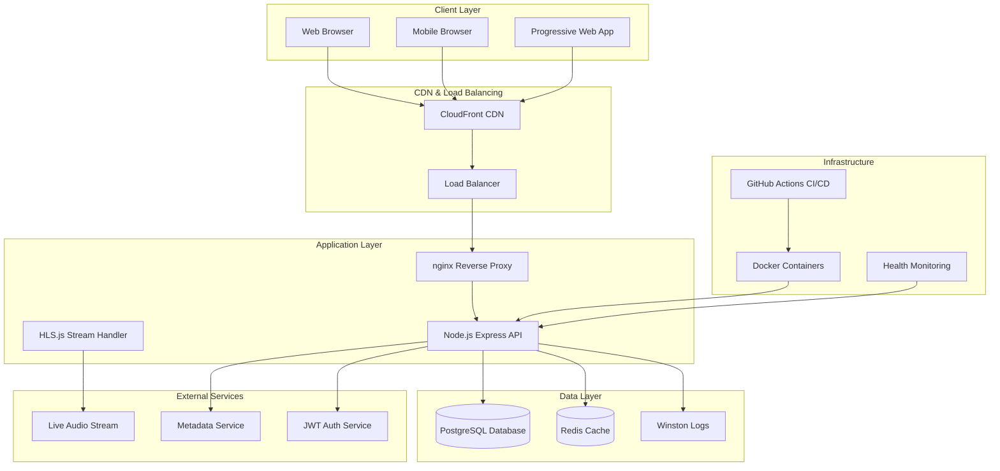
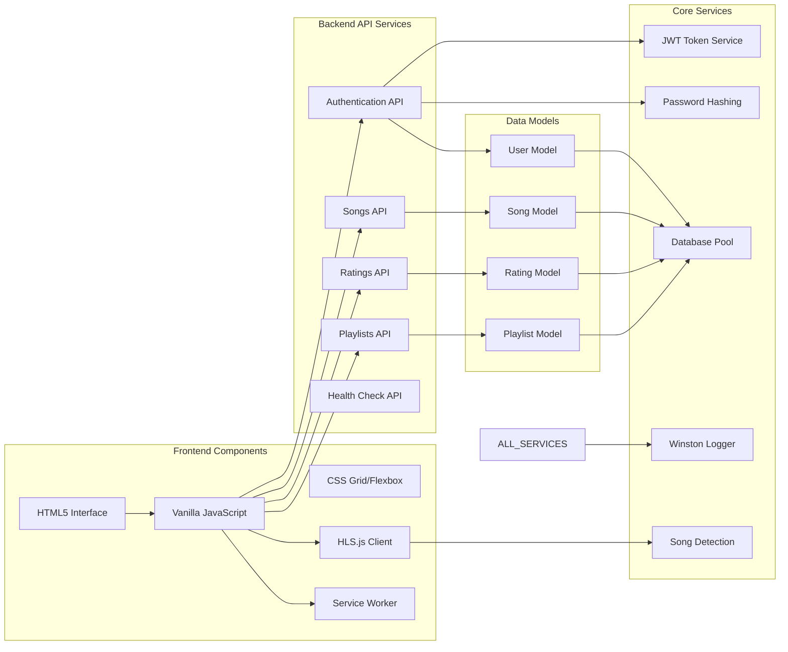
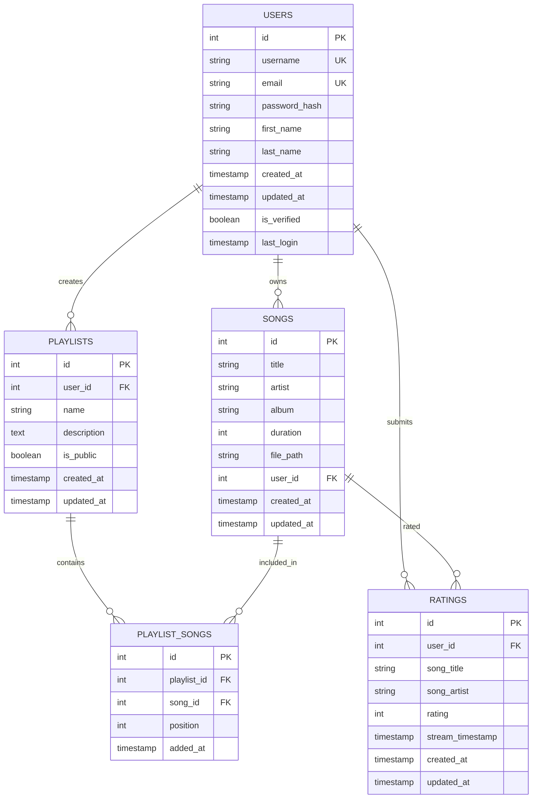
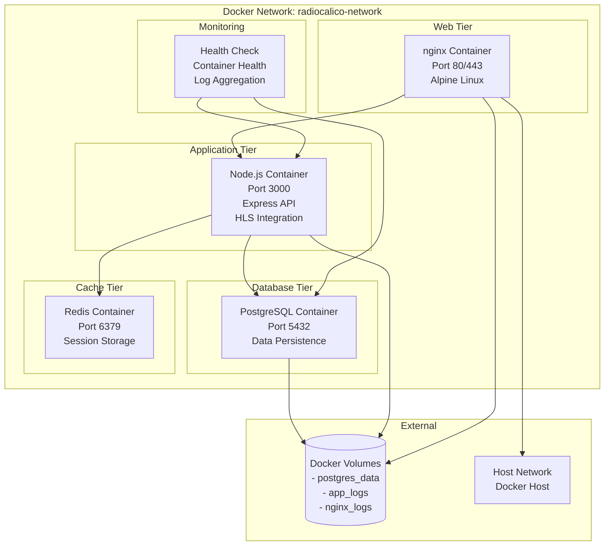
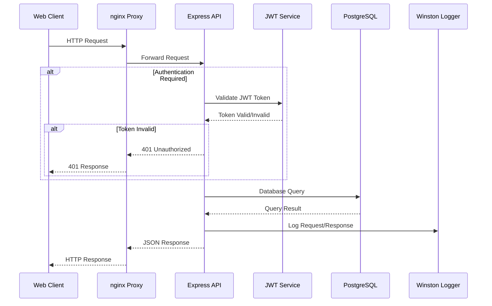
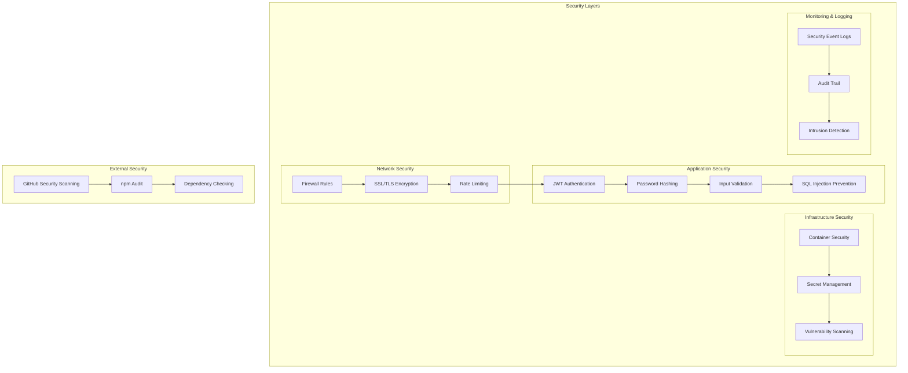
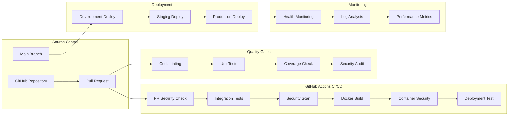
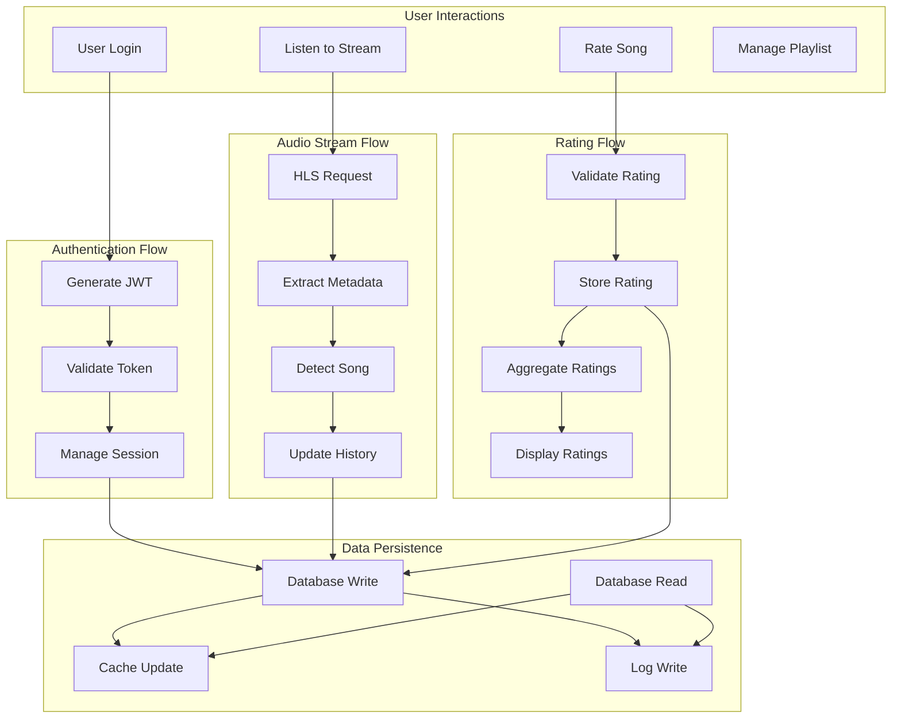
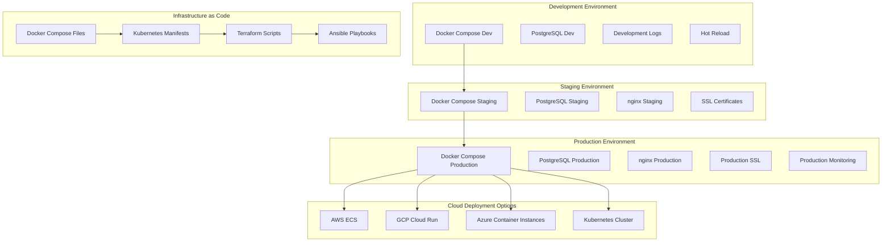

# Radio Calico - System Architecture

This document provides a comprehensive overview of the Radio Calico system architecture, including component interactions, data flows, and deployment strategies.

## High-Level Architecture Overview



## Detailed Component Architecture



## Database Architecture



## Container Architecture



## API Request Flow



## Live Streaming Architecture

```mermaid
graph LR
    subgraph "Audio Source"
        AUDIO_INPUT[Live Audio Input]
        ENCODER[Audio Encoder<br/>24-bit/48kHz]
    end

    subgraph "CDN Distribution"
        ORIGIN[Origin Server]
        CF_CDN[CloudFront CDN<br/>Global Distribution]
        EDGE[Edge Locations]
    end

    subgraph "Client Playback"
        HLS_MANIFEST[HLS Playlist<br/>(.m3u8)]
        SEGMENTS[Audio Segments<br/>(.ts files)]
        PLAYER[HLS.js Player]
        METADATA_EXTRACTOR[Metadata Extractor]
    end

    subgraph "Metadata Flow"
        SONG_DETECTION[Song Detection]
        RATING_SYSTEM[Real-time Rating]
        HISTORY_TRACKER[Play History]
    end

    AUDIO_INPUT --> ENCODER
    ENCODER --> ORIGIN
    ORIGIN --> CF_CDN
    CF_CDN --> EDGE
    EDGE --> HLS_MANIFEST
    HLS_MANIFEST --> SEGMENTS
    SEGMENTS --> PLAYER
    PLAYER --> METADATA_EXTRACTOR
    METADATA_EXTRACTOR --> SONG_DETECTION
    SONG_DETECTION --> RATING_SYSTEM
    SONG_DETECTION --> HISTORY_TRACKER
```

## Security Architecture



## CI/CD Pipeline Architecture



## Performance Architecture

```mermaid
graph TB
    subgraph "Frontend Performance"
        CODE_SPLITTING[Code Splitting<br/>Core: 15KB<br/>Lazy: 100KB]
        LAZY_LOADING[Lazy Loading<br/>Images & Components]
        SERVICE_WORKER[Service Worker<br/>Caching Strategy]
        WEB_VITALS[Core Web Vitals<br/>Monitoring]
    end

    subgraph "Backend Performance"
        CONNECTION_POOL[DB Connection Pool<br/>Max: 10 connections]
        QUERY_OPTIMIZATION[Query Optimization<br/>Indexes & Prepared Statements]
        RESPONSE_CACHING[Response Caching<br/>Redis TTL]
        API_RATE_LIMITING[API Rate Limiting<br/>100 req/min/user]
    end

    subgraph "Infrastructure Performance"
        CDN_CACHING[CDN Caching<br/>Static Assets]
        GZIP_COMPRESSION[Gzip Compression<br/>API Responses]
        HTTP2[HTTP/2 Support<br/>Multiplexing]
        LOAD_BALANCING[Load Balancing<br/>Multiple Instances]
    end

    subgraph "Monitoring"
        PERFORMANCE_METRICS[Performance Metrics<br/>Response Times]
        ERROR_TRACKING[Error Tracking<br/>Exception Monitoring]
        RESOURCE_MONITORING[Resource Monitoring<br/>CPU/Memory/Disk]
    end

    CODE_SPLITTING --> LAZY_LOADING
    LAZY_LOADING --> SERVICE_WORKER
    SERVICE_WORKER --> WEB_VITALS

    CONNECTION_POOL --> QUERY_OPTIMIZATION
    QUERY_OPTIMIZATION --> RESPONSE_CACHING
    RESPONSE_CACHING --> API_RATE_LIMITING

    CDN_CACHING --> GZIP_COMPRESSION
    GZIP_COMPRESSION --> HTTP2
    HTTP2 --> LOAD_BALANCING

    PERFORMANCE_METRICS --> ERROR_TRACKING
    ERROR_TRACKING --> RESOURCE_MONITORING
```



## Data Flow Architecture



## Deployment Architecture



## Architecture Principles

### 1. **Scalability**
- Microservices-ready architecture with separated concerns
- Horizontal scaling support through containerization
- Database connection pooling and query optimization
- CDN integration for global content delivery

### 2. **Security**
- Multi-layer security approach (network, application, infrastructure)
- JWT-based stateless authentication
- Input validation and SQL injection prevention
- Regular security scanning and vulnerability management

### 3. **Performance**
- Code splitting and lazy loading for optimal frontend performance
- Caching strategies at multiple levels (browser, CDN, application, database)
- Optimized database queries with proper indexing
- Resource monitoring and performance metrics

### 4. **Reliability**
- Health checks and monitoring at all levels
- Comprehensive error handling and logging
- Database backup and recovery procedures
- Graceful degradation for service failures

### 5. **Maintainability**
- Clean separation of concerns with modular architecture
- Comprehensive documentation and API specifications
- Automated testing and CI/CD pipelines
- Infrastructure as Code for reproducible deployments

### 6. **Observability**
- Structured logging with Winston
- Performance monitoring and Core Web Vitals tracking
- Health endpoints for system status monitoring
- Error tracking and exception handling

## Technology Decisions

### Frontend Architecture
- **Vanilla JavaScript**: No framework dependencies for optimal performance and minimal bundle size
- **CSS Grid/Flexbox**: Modern layout techniques for responsive design
- **HLS.js**: Industry-standard for HTTP Live Streaming with broad browser support
- **Service Workers**: Offline-first approach with intelligent caching

### Backend Architecture
- **Node.js/Express**: Lightweight, fast, and JavaScript ecosystem compatibility
- **PostgreSQL**: ACID compliance, advanced features, and excellent performance
- **JWT Authentication**: Stateless, scalable, and secure authentication
- **Winston Logging**: Structured logging with multiple transports and rotation

### Infrastructure Architecture
- **Docker**: Consistent environments across development, staging, and production
- **nginx**: High-performance reverse proxy with SSL termination
- **GitHub Actions**: Integrated CI/CD with security scanning and automated testing
- **CloudFront CDN**: Global content delivery for optimal streaming performance

This architecture supports Radio Calico's current requirements while providing a foundation for future growth and feature expansion.
